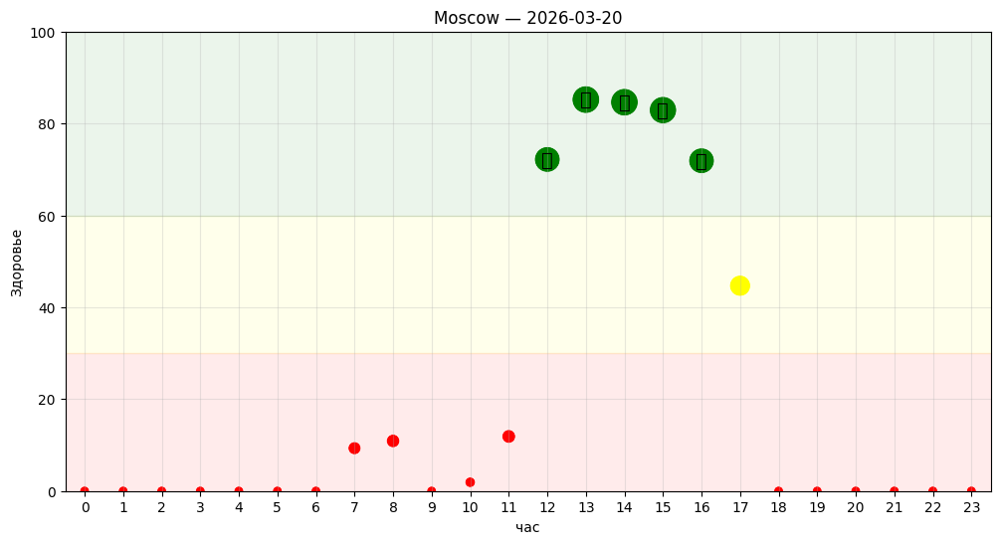
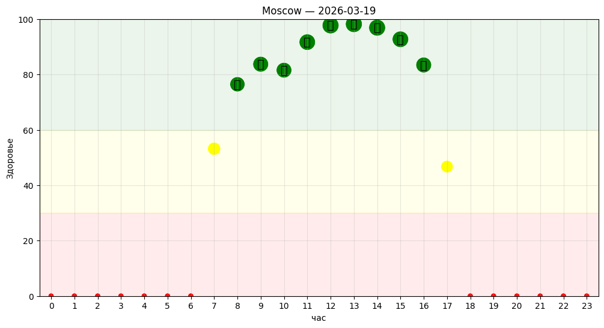
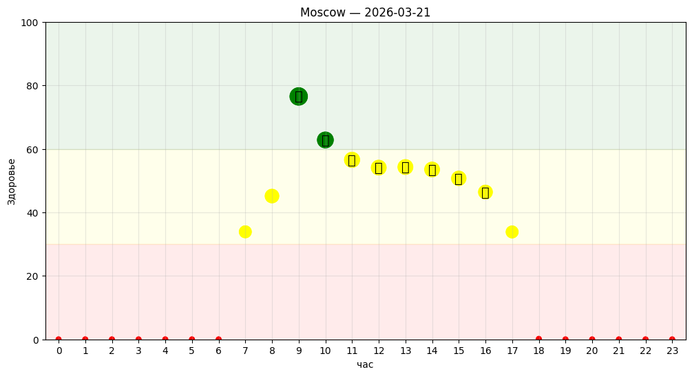

# HealthWalkOptimizer

Оптимизатор прогулок для максимизации здоровья на основе погодных данных,
солнечной освещённости и ветровых условий.

---

## 📌 Описание

Программа анализирует погодные условия (вчера, сегодня и завтра) и
определяет **оптимальные часы для прогулки**, максимизирующие пользу для здоровья.

Система автоматически:
- получает координаты выбранного города
- загружает исторические и прогнозные погодные данные
- рассчитывает освещённость (lux) на основе положения солнца
- оценивает влияние ветра и облачности
- вычисляет интегральный показатель здоровья
- находит лучшее временное окно для прогулки
- визуализирует результат

---
## 📊 Примеры работы

### День 1


### День 2


### День 3


---
## 🧠 Модель

Каждый момент времени (час) оценивается через функцию:

- **Освещённость (lux)**  
  зависит от высоты солнца и облачности  

- **Ветер (wind)**  
  учитывает средний ветер и порывы  

- **Health Score (0–100)**  
  итоговая метрика полезности прогулки  

---

## ⚙️ Логика расчёта

### 1. Солнечная высота
Рассчитывается по астрономической модели через:
- день года
- время суток
- широту и долготу

### 2. Освещённость (lux)
Учитывает:
- угол солнца
- облачность

### 3. Интегральный показатель здоровья
Балансирует:
- пользу солнечного света
- дискомфорт от ветра

---

## ⭐ Основной результат

Для каждого дня программа:

- показывает **ТОП-10 лучших часов**
- даёт **интерпретацию условий**:
  - 🌞 солнце / 🌥 облачность
  - 🍃 ветер
  - 🥶 температура
- определяет:
  
  👉 **лучшее непрерывное окно для прогулки**

---

## 📊 Визуализация

График:
- X — час (0–23)
- Y — показатель здоровья (0–100)

Цвет:
- 🟢 зелёный — отлично
- 🟡 жёлтый — средне
- 🔴 красный — плохо

Лучшее окно отмечается значками 🚶

---

## 🌍 Данные

Используется API:
- Open-Meteo (архив + прогноз)
- Геокодинг для определения координат города

---

## 🚀 Запуск

```bash
python 3_days.py